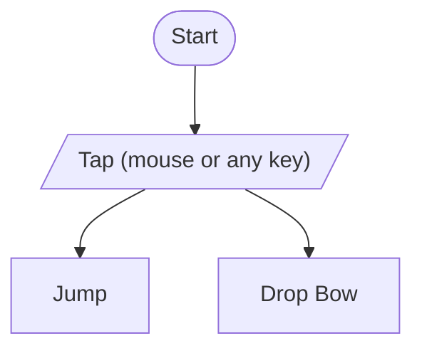

# tap-tap-tap
one input, two games!

## isometric jump
> jump over gaps in the moving platforms!

## factory dropper
> drop bows onto boxes on the conveyer belt!

## ...

```mermaid
flowchart TB
	A(["Start"]) --> B["Tap (mouse or any key)"]
	B --> n1["Jump"] & n3["Drop Bow"]
	B@{ shape: lean-r}
```
